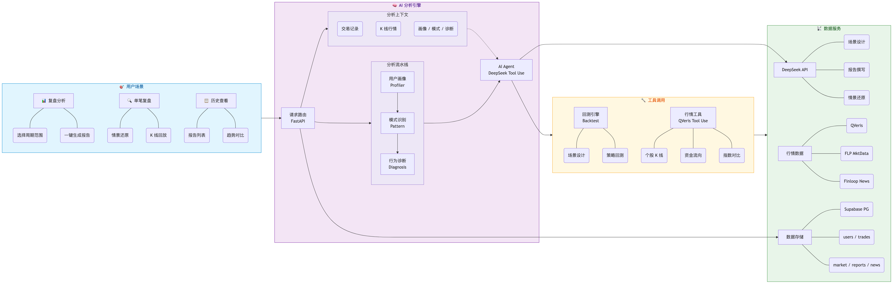
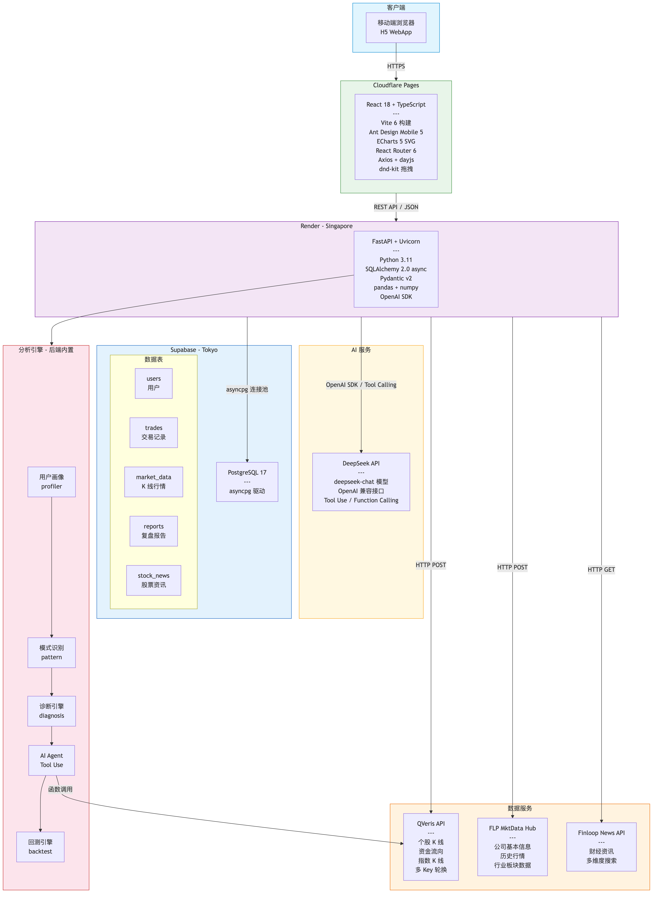

# TradeMind AI — 交易复盘分析工具

面向券商个人投资者的 AI 交易复盘分析 H5 应用，帮助用户分析交易行为、识别模式、诊断问题并生成周期性复盘报告与单笔交易情景还原。

## 功能亮点

- **AI 交易时空机** — 历史 K 线回放、买卖点标记、单笔情景还原、大盘对比、逐日行情、持仓期间资讯
- **AI 交易行为诊断** — 6 种交易模式识别（追高、止盈过早、止损过慢等），严重度评分、LLM 风格描述
- **AI 胜率归因与策略教练** — 复盘总结、改进建议、6 种回测场景、LLM 千人千面个性化分析
- **周期性复盘报告** — 一键生成指定时间范围内的完整复盘报告，异步生成、轮询查看

## 核心架构

<p align="center">
  
</p>

## 技术架构

<p align="center">
  
</p>

## 技术栈

| 层级 | 技术 |
|------|------|
| **前端** | React 18 · TypeScript · Ant Design Mobile 5 · ECharts 5 · Vite 6 |
| **后端** | Python 3.11 · FastAPI · SQLAlchemy 2.0 (async) · Pydantic v2 · pandas · numpy |
| **数据库** | Supabase PostgreSQL 17 · asyncpg |
| **AI** | DeepSeek API (deepseek-chat) · OpenAI 兼容接口 · Tool Use / Function Calling |
| **行情数据** | QVeris API · FLP MktData Hub |
| **资讯数据** | Finloop News API |
| **部署** | Cloudflare Pages (前端) · Render (后端) |

## 项目结构

```
TradeMind/
├── frontend/                        # React H5 前端
│   ├── src/
│   │   ├── pages/                   # 页面组件
│   │   ├── components/              # 通用组件（图表、轮播等）
│   │   ├── services/api.ts          # API 封装（Axios）
│   │   ├── contexts/AuthContext.tsx  # 认证状态管理
│   │   └── constants/               # 账户配置、状态映射
│   └── package.json
├── backend/                         # FastAPI 后端 + 分析引擎
│   ├── app/
│   │   ├── api/                     # API 路由
│   │   │   ├── reports.py           # 报告生成与查询
│   │   │   ├── trades.py            # 交易列表 + 单笔复盘
│   │   │   ├── users.py             # 用户画像
│   │   │   └── market.py            # 行情 K 线
│   │   ├── services/                # 服务层
│   │   │   ├── ai_agent.py          # AI 报告生成（Tool Use Agent）
│   │   │   ├── profiler.py          # 用户画像分析
│   │   │   ├── pattern.py           # 模式识别
│   │   │   ├── diagnosis.py         # 行为诊断
│   │   │   ├── backtest.py          # 回测引擎
│   │   │   └── qveris_client.py     # QVeris 行情客户端
│   │   ├── models/                  # ORM + Pydantic 模型
│   │   └── core/                    # 配置、数据库、常量
│   ├── scripts/
│   │   └── seed_supabase.py         # Supabase 数据补种
│   └── requirements.txt
└── assets/                          # 架构图
```

## 快速开始

### 环境要求

- Python 3.11+
- Node.js 18+
- npm 9+

### 1. 克隆项目

```bash
git clone https://github.com/buuzzy/fincoach.git
cd fincoach
```

### 2. 后端配置

```bash
cd backend
pip install -r requirements.txt
cp .env.example .env
```

编辑 `backend/.env`，填入以下密钥：

```env
# ─── LLM 配置 ───────────────────────────────────────────
LLM_BASE_URL=https://api.deepseek.com    # DeepSeek API 地址
LLM_API_KEY=sk-xxx                       # DeepSeek API Key
LLM_MODEL=deepseek-chat                  # 模型名称

# ─── 数据库 ─────────────────────────────────────────────
# 开发环境（SQLite，无需额外配置）
DATABASE_URL=sqlite+aiosqlite:///./coach.db

# 生产环境（Supabase PostgreSQL）
# DATABASE_URL=postgresql+asyncpg://postgres.<project>:<password>@<host>:6543/postgres
# SUPABASE_DATABASE_URL=postgresql+asyncpg://postgres.<project>:<password>@<host>:6543/postgres

# ─── QVeris 行情 API（多 Key 轮换，至少填一个）─────────
QVERIS_API_KEY=sk-xxx
QVERIS_API_KEY_2=
QVERIS_API_KEY_3=
QVERIS_API_KEY_4=
QVERIS_API_KEY_5=

# ─── 其他 ───────────────────────────────────────────────
FORCE_RESEED=false                       # 是否每次启动强制重新补种数据
```

### 3. 启动后端

```bash
cd backend
uvicorn app.main:app --reload --port 8000
```

首次启动会自动补种 mock 数据。API 文档：http://localhost:8000/docs

### 4. 前端配置

```bash
cd frontend
npm install
```

开发环境下 Vite 会自动代理 `/api` 到 `localhost:8000`，无需额外配置。

生产环境需创建 `frontend/.env`：

```env
VITE_API_BASE_URL=https://your-backend-url.com
```

### 5. 启动前端

```bash
cd frontend
npm run dev
```

访问 http://localhost:5173

### 6. 数据补种（可选）

如需手动向 Supabase 补种数据：

```bash
cd backend
python scripts/seed_supabase.py              # 全量补种
python scripts/seed_supabase.py --news-only   # 仅补种资讯
python scripts/seed_supabase.py --index-only  # 仅补种上证指数
```

## API 端点

| 方法 | 路径 | 说明 |
|------|------|------|
| `POST` | `/api/auth/login` | 用户登录 |
| `POST` | `/api/reports/generate` | 触发报告生成（异步） |
| `GET` | `/api/reports/{report_id}` | 获取报告详情（轮询） |
| `GET` | `/api/reports/` | 报告列表 |
| `GET` | `/api/users/{user_id}/profile` | 用户画像 |
| `GET` | `/api/trades/{user_id}/closed` | 已平仓交易列表 |
| `GET` | `/api/trades/review/{buy_id}/{sell_id}` | 单笔交易情景还原 |
| `GET` | `/api/market-data/{stock_code}` | K 线行情 |

## 线上地址

| 服务 | 地址 |
|------|------|
| 前端 | https://fincoach-aee.pages.dev |
| 后端 API | https://fincoach-backend.onrender.com |
| API 文档 | https://fincoach-backend.onrender.com/docs |

## License

MIT
